# RPG Template - GameMaker Studio 2

A compact RPG template built with **GameMaker Studio 2**, combining top-down exploration, NPC dialogue, item management, a shop system, and turn-based battles.

The project was created as a reusable foundation for experimenting with RPG mechanics, UI, combat systems, visual effects, and GameMaker architecture.

## 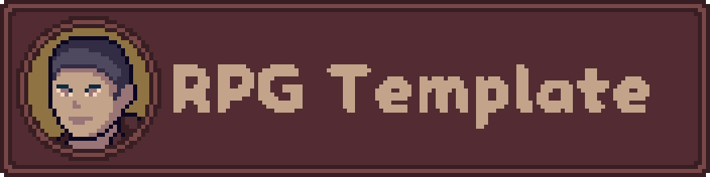

The game is divided into two main gameplay moments:

1. **Exploration** — the player moves through a top-down world, interacts with NPCs, opens chests, encounters enemies, and accesses the shop.
2. **Turn-based Combat** — approaching an enemy starts a battle where the player can attack, defend, or use items.

The project also includes menus, pause functionality, configuration options, transitions, level progression, audio feedback, particles, and multiple UI components.

## 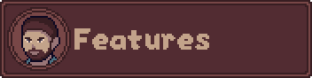

### 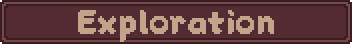

* Top-down player movement.
* Walking and sprinting.
* Collision with environmental objects.
* Camera following the player.
* Animated player sprites.
* Enemy movement around the world.
* Enemy detection and chase behavior.
* Enemy encounters that transition into battles.
* Chests and interactive objects.
* NPCs and dialogue.
* Interactive keyboard/mouse cursor system.

### 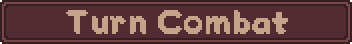

The battle system includes:

* Player and enemy teams.
* Turn order based on speed.
* Attack action.
* Defense action.
* Item usage during battle.
* Automatic target selection when only one valid target exists.
* Mouse and keyboard target selection.
* Damage calculation using attack and defense stats.
* Damage numbers.
* Hit and death particle effects.
* Attack, damage, death, and item sounds.
* Victory and defeat detection.
* Experience rewards.
* Gold rewards.
* Level-up system.

### 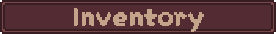

The current item database contains:

* **Small Potion** — restores 25 HP.
* **Great Potion** — restores 50 HP.
* **Medic Kit** — restores the character to full HP.

The inventory system supports:

* Item quantities.
* Adding existing or new items.
* Item selection.
* Item usage.
* Removing items when their quantity reaches zero.
* Using items both inside and outside battle.

### 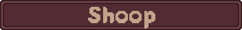

The project includes a shop interface with:

* NPC shopkeeper.
* Item listing.
* Item prices.
* Player gold display.
* Item selection.
* Buy/sell-oriented UI components.
* NPC dialogue.
* Keyboard and mouse navigation.

### 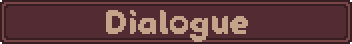

The dialogue system supports:

* Character names.
* Character avatars.
* Dialogue text.
* Multiple dialogue entries.
* Dialogue options.
* Keyboard interaction.
* Automatic button generation for dialogue choices.
* Player movement locking while dialogue is active.

### 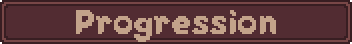

Characters have RPG statistics such as:

* HP
* Attack
* Defense
* Speed
* Level
* Experience

Leveling up increases the character's statistics and generates a level-up result that can be displayed by the victory screen.

### 

The project contains several reusable visual systems:

* Screen transitions.
* Fade-in/fade-out sequences.
* Screen shake.
* Hit effects.
* Death effects.
* Item effects.
* Button hover animations.
* Button selection feedback.
* Blinking effects.
* Damage numbers.
* Text borders/outlines.
* Custom fonts.
* Custom color palette.
* Animated sprites.

### 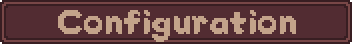

The project includes configuration support for:

* Fullscreen mode.
* Mouse cursor mode.
* Keyboard controls.
* Audio volume.

Configuration data is stored using an `.ini` file.

## 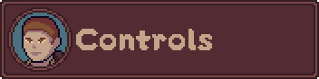

| Action           | Default Input |
| ---------------- | ------------- |
| Move Up          | `W`           |
| Move Left        | `A`           |
| Move Down        | `S`           |
| Move Right       | `D`           |
| Sprint           | `Ctrl`        |
| Interact         | `E`           |
| Confirm / Select | `Enter`       |
| Mouse            | Optional      |

Keyboard controls are stored as configurable global variables, making them easy to change in the project.

## Characters

The project currently contains a small example party and enemy setup used to demonstrate the RPG systems.

### Player Characters

* **Fulano**
* **Ciclano**
* **Beltrano**

Each character is represented by a data structure containing:

* Name
* Sprites
* HP
* Attack
* Defense
* Speed
* Level
* Experience

### Enemy

The current example enemy is:

* **Hollow**

Enemies use the same general character-stat structure, allowing the combat system to work with reusable character data.

## Combat System

Combat is driven by character speed.

At the beginning of a battle, player and enemy characters are inserted into the battle arrays and sorted according to their speed.

The character at the current turn can perform an available action.

### Attack

Damage is calculated from the attacker's attack value and the target's defense.

A minimum damage value is enforced so that valid attacks always cause at least some damage.

When an attack is performed, the game can trigger:

* Attack animation.
* Screen shake.
* Damage number.
* Hit particle effect.
* Death particle effect.
* Damage sound.
* Death sound.

### Defense

Defense temporarily increases the active character's defense value.

The defense state is later removed, returning the character to its previous defensive value.

### Items

Items can be used during battle by selecting a valid living ally.

The system automatically skips unnecessary target selection when only one ally is alive.

When an enemy reaches the player, the current room is stored and a battle transition is triggered.

## Rooms

The project is organized into several GameMaker rooms:

| Room         | Purpose                         |
| ------------ | ------------------------------- |
| `rm_splash`  | Splash / initial loading screen |
| `rm_menu`    | Main menu                       |
| `rm_world`   | Main exploration area           |
| `rm_battle`  | Turn-based combat               |
| `rm_shop`    | Shop and NPC interaction        |
| `rm_config`  | Configuration                   |
| `rm_pause`   | Pause menu                      |
| `rm_win`     | Victory screen                  |
| `rm_lose`    | Defeat screen                   |
| `rm_restart` | Restart flow                    |
| `rm_exit`    | Exit flow                       |

Transitions between rooms use dedicated transition sequences.

## Project Structure

The project follows GameMaker's resource-based organization.

### Scripts

Important systems are separated into dedicated scripts:

```text
scripts/
├── scr_attack
├── scr_audio
├── scr_characters
├── scr_defense
├── scr_draw_button
├── scr_item
├── scr_itens
├── scr_level_up
├── scr_player
├── scr_shake
├── scr_start_game
├── scr_use_item
├── scr_win_lose
│
├── src_button_hover
├── src_color
├── src_pause
├── src_pisca
├── src_text_border
└── src_transition
```

### Objects

Objects are divided into groups responsible for:

* Player control.
* Enemies.
* Characters.
* Battle UI.
* Menus.
* Buttons.
* Shop.
* Dialogue.
* Pause.
* Configuration.
* Camera.
* Transitions.
* Visual feedback.

### Resources

The project also contains:

* Sprites.
* Fonts.
* Sounds.
* Particle systems.
* Sequences.
* Tilesets.
* Rooms.

Dialogue, pause, configuration, and other interface systems can be accessed through their respective UI flows.

## 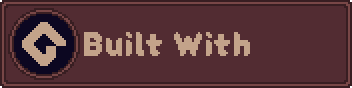

* **GameMaker Studio 2**
* **GML (GameMaker Language)**
* GameMaker Rooms
* GameMaker Objects
* GML Scripts
* Sequences
* Particle Systems
* Custom Sprites
* Custom Fonts
* Custom Audio
